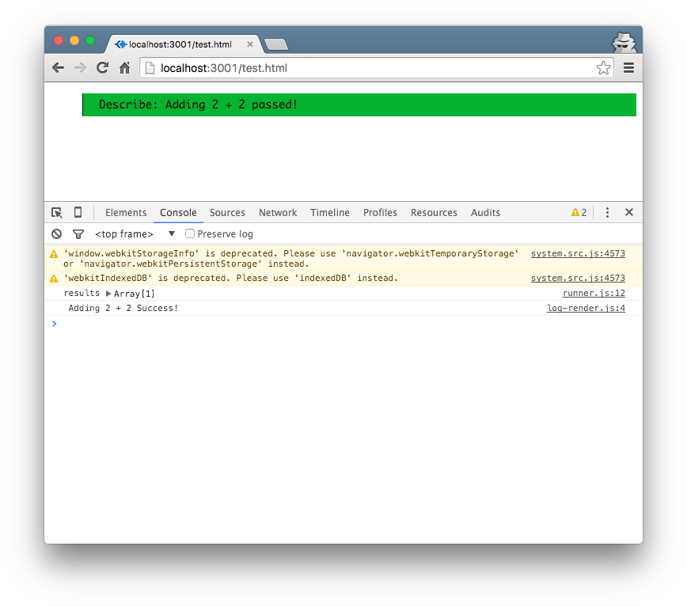
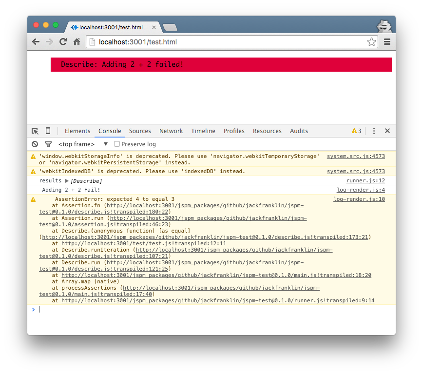

# jspm test

A __browser__ test runner for jspm projects. Not _yet_ considered production ready.

## The problem

I spend a lot of time working on React and jspm projects, but the testing story isn't perfect with these. If your app is managed through jspm, you'll likely have to reinstall all these dependencies again in Node land to be able to use a testing framework with them. Often this is fine, but sometimes you just want to easily run tests in the browser and reuse your initial dependencies. This is what jspm-test does.

## How

### Installing

Install jspm-test from GitHub:

```
jspm install jspm-test=github:jackfranklin/jspm-test@0.1.1
```

### Creating the test runner

Then, create `test.html` in the root of your app:

```html
<!DOCTYPE html>
<html>
  <head>
    <script src="jspm_packages/system.js"></script>
    <script src="config.js"></script>
    <script>System.import('test-runner');</script>
  </head>
  <body>
  </body>
</html>
```

Then create `test-runner.js`:

```js
import {
  runTestsOnFiles
} from 'jspm-test/runner';

const testFiles = [
  'test/my-test.js'
];

runTestsOnFiles(testFiles);
```

Simply import the `runTestsOnFiles` and pass it a list of test files that it should run.

### Writing a test

```js
import { describe } from 'jspm-test/describe';

describe('Adding 2 + 2', (t) => {
  t.equal(2 + 2, 4);
});
```

The `describe` function is all you need to import. It passes in an object to the callback function that contains assertion methods on it. See below for the methods available to you, nested tests and more. The API is strongly influenced by [tape](https://github.com/substack/tape), which is my go-to testing framework in Node land.

### Running the tests

Run your application and visit `/test.html` that we created earlier. You should see a passing test!



Now, let's make that test fail:

```js
import { describe } from 'jspm-test/describe';

describe('Adding 2 + 2', (t) => {
  t.equal(2 + 2, 3);
});
```

Refresh, and you'll see the test fail. Any errors are also logged to the console so you get clickable stack traces:



## Available Assertions

### `t.deepEqual`

Asserts that two objects are deeply equal:

```js
describe('Foo', (t) => {
  t.deepEqual({ x: 1 }, { y: 1 }); // will fail
});
```

### `t.ok`

Asserts that the given variable is truthy:

```js
describe('Foo', (t) => {
  t.ok(true);
  t.ok({});
  t.ok(false); // fail
});
```

### `t.equal`

Asserts that two variables are __strictly__ equal (using `===`).

```js
describe('Foo', (t) => {
  t.equal(2, 2);
  t.equal(2, '2'); // fail
});
```

## Adding Custom Assertions

Rather than create yet another assertion library, jspm-test wraps some of [Chai](http://chaijs.com/)'s assertions. By default only `t.ok`, `t.deepEqual` and `t.equal` are available but you can add others.

To do this, you need to import and call `wrapAssertion`. This function takes the name of the assertion and a function that will be called with the arguments. The function is expected to raise an error if it fails, and do nothing if it passes. For example, here's how `t.equal` is implemented in jspm-test:

```js
wrapAssertion('equal', (x, y) => {
  expect(x).to.equal(y);
});
```

And here's how you might add your own custom assertion:

```js
import { wrapAssertion } from 'jspm-test/describe';

wrapAssertion('isFour', (x) => {
  if (x !== 4) {
    throw new Error('Given value wasn\'t equal to 4');
  }
});

// then in a test

describe('Is 4', (t) => {
  t.isFour(5); // uh oh...
});
```


## TODO / Coming Soon

- Thorough documentation on other features of jspm-test, including async tests.
- PhantomJS script / support for `jspm run` such that tests can run in a CI environment.
- Support for jspm-hot-reloader, so tests runs are crazy quick.
- Improve the CSS for the browser tests (any help more than welcome!)
